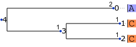

This example is taken from `testJointLikelihood` in
[AncestralStateTreeLikelihoodTest.java](https://github.com/beast-dev/beast-mcmc/blob/master/src/test/dr/evomodel/treelikelihood/AncestralStateTreeLikelihoodTest.java)
which first imputes ancestral states using maximum marginal probabilities
and then checks the log likelihood that uses the imputed data.

In this test, the tree has three leaves and two internal nodes.
Leaf 0 has state `A`, and leaves 1 and 2 have state `C`.

As shown in the [marginal](marginal) subdirectory,
the maximum marginal probability state is `C`
for both internal nodes under a Jukes-Cantor model of molecular evolution.

The [ll](ll) subdirectory checks the log likelihood under the imputed states.
Because the state at each internal and leaf node is assumed to be
known after the imputation, and because of the relative simplicity
of Jukes-Cantor state transition probabilities, it is possible
to compute the log likelihood associated with the imputed data
directly without 'pruning' and without numerically solving
differential equations.
