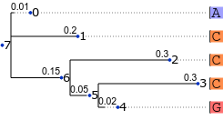

This directory contains examples of various analyses of
a toy scenario taken from Figure 16.4 of Inferring Phylogenies (2004)
by Joseph Felsenstein.
A single column of a nucleotide alignment is analyzed
under a Jukes-Cantor model of molecular evolution.
The shape of the tree and the prior expected number of changes
on each branch are considered to be known.



Most of the analyses operate on input similar to the JSON string below.

```json
{
"model_and_data" :
  {
  "edges" : [[7, 0], [7, 1], [7, 6], [6, 2], [6, 5], [5, 3], [5, 4]],
  "edge_rate_coefficients" : [0.01, 0.2, 0.15, 0.3, 0.05, 0.3, 0.02],
  "root_prior" : [0.25, 0.25, 0.25, 0.25],
  "rate_matrix" : [
	 [0, 1, 1, 1],
	 [1, 0, 1, 1],
	 [1, 1, 0, 1],
	 [1, 1, 1, 0]],
  "rate_divisor" : 3,
  "probability_array" : [
	 [[1, 0, 0, 0],
	  [0, 1, 0, 0],
	  [0, 1, 0, 0],
	  [0, 1, 0, 0],
	  [0, 0, 1, 0],
	  [1, 1, 1, 1],
	  [1, 1, 1, 1],
	  [1, 1, 1, 1]]]
   }
}
```

Here are some explanations of the strings it contains:
<dl>

<dt>model_and_data</dt>
<dd>
This object specifies everything about the input except
for selection/reduction/aggregation requests.
</dd>

<dt>edges</dt>
<dd>
An ordered list of ordered node index pairs.
Edges are indexed according to their position in this list.
This list defines the 'tree topology'.
</dd>

<dt>edge_rate_coefficients</dt>
<dd>
An ordered list of edge-specific rate scaling factors.
The nth coefficient in this list is associated with the nth
entry of the list of edges.
</dd>

<dt>root_prior</dt>
<dd>
An optional prior distribution over states at the node
situated at the root of the tree.
</dd>

<dt>rate_matrix</dt>
<dd>
Off-diagonal entries specify transition rates between states.
The CTMC process defined by this rate matrix is shared across
all edges of the tree, although each edge may further scale this rate
by its own coefficient.
Diagonal entries of this matrix are ignored.
The rate matrix in this particular example defines a Jukes-Cantor process.
</dd>

<dt>rate_divisor</dt>
<dd>
In this example, the rate matrix is scaled by 1/3
so that the off-diagonal entries of each row of the scaled matrix
add up to 1.
</dd>

<dt>probability_array</dt>
<dd>
This is a 3 dimensional nd-array that allows a separate
emission likelihood to be specified for each (site, node, state) triple.
In this example we have 1 site, 8 nodes, and 4 nucleotide states (A, C, G, T).
The first five rows define a single column (ACCCG)
in an alignment of 5 leaf taxon nucleotide sequences,
and the last three rows indicate that no nucleotide sequence data is available
for any of the three internal nodes for this column.
This format is quite flexible but is unwieldy for large amounts of data.
</dd>

</dl>
