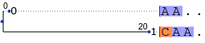

Motivating example
---

This example involves a single branch
under a Jukes-Cantor process of evolution,
and was created in response to the question
"Regardless of the rate matrix,
for which kinds of trees or branch lengths
is it less feasible to compute derivatives using
[finite differences](https://en.wikipedia.org/wiki/Difference_quotient)?
Is it when branch lengths are large?"

The short answer is yes,
the derivatives estimated using finite differences of double precision
log likelihoods will be zero when the branches are very long.
This is true even when the derivatives are not too small to be
represented precisely with double floats, and it is true even when the
double precision log likelihoods have no error except truncation error.

For an extremely simple tree
consisting of only a single branch with observations at both endpoints,
and assuming a Jukes-Cantor process,
the double precision log likelihood is indistinguishable from
`log(1/16)` when the branch length is large enough that at least
29 substitutions are expected on the branch.
This is true regardless of whether the initial and final states
are identical or non-identical.

```shell
$ arbplf-ll < jc29.same.json 
{"columns": ["site", "value"], "data": [[0, -2.7725887222397811]]}
$ arbplf-ll < jc29.diff.json 
{"columns": ["site", "value"], "data": [[0, -2.7725887222397811]]}
$ arbplf-ll < jc30.same.json 
{"columns": ["site", "value"], "data": [[0, -2.7725887222397811]]}
$ arbplf-ll < jc30.diff.json 
{"columns": ["site", "value"], "data": [[0, -2.7725887222397811]]}
```

Because the double precision log likelihood is the same across all
of these endpoint and branch length combinations,
the derivatives of log likelihood with respect to branch lengths
will be similarly uninformative (equal to zero) if computed using
double precision finite differences.

On the other hand, derivatives computed less naively
can be distinguished across these various combinations.

```shell
$ arbplf-deriv < jc29.same.json
{"columns": ["site", "edge", "value"], "data": [[0, 0, -6.4467380574161446e-17]]}
$ arbplf-deriv < jc29.diff.json 
{"columns": ["site", "edge", "value"], "data": [[0, 0, 2.1489126858053815e-17]]}
$ arbplf-deriv < jc30.same.json
{"columns": ["site", "edge", "value"], "data": [[0, 0, -1.6993417021166355e-17]]}
$ arbplf-deriv < jc30.diff.json 
{"columns": ["site", "edge", "value"], "data": [[0, 0, 5.6644723403887852e-18]]}
```

These derivatives can be checked using explicit formulas.

```python
>>> -4 / (exp(4*29 / 3) + 3)
-6.4467380574161606e-17
>>> 4 / (3*exp(4*29 / 3) - 3)
2.1489126858053865e-17
>>> -4 / (exp(4*30 / 3) + 3)
-1.6993417021166355e-17
>>> 4 / (3*exp(4*30 / 3) - 3)
5.6644723403887852e-18
```

However if the branch lengths are large enough,
it is possible that the derivative of the log likelihood with
respect to the branch length is closer to zero than to any
positive number representable in double precision.
Because the numbers in the JSON output are double-precision approximations,
the result in this case is uninformative even if it is computed without
precision loss due to internal rounding or cancellation.
This can occur when the derivatives are smaller than around 10^-300.

```shell
$ arbplf-deriv < jc600.same.json 
{"columns": ["site", "edge", "value"], "data": [[0, 0, 0.0]]}
```

Additional examples
---

The subdirectories of `JC.long.branch` have various analyses
of the single long branch Jukes-Cantor scenario.
For these examples a branch length of 20 unconditionally
expected substitutions is used, and four endpoint scenarios are considered
for each example:

 - both endpoints are observed and have different states
 - both endpoints are observed and have the same state
 - one endpoint is unobserved
 - both endpoints are unobserved



The analyses considered are `ll`, `deriv`, `marginal`, `dwell`, and `trans`.
All of these additional examples use the following json input file:

```json
{
  "model_and_data" : {
    "edges" : [[0, 1]],
    "edge_rate_coefficients" : [20],
    "root_prior" : [0.25, 0.25, 0.25, 0.25],
    "rate_matrix" : [
      [0, 1, 1, 1],
      [1, 0, 1, 1],
      [1, 1, 0, 1],
      [1, 1, 1, 0]],
    "rate_divisor" : 3,
    "character_definitions" : [
      [1, 0, 0, 0],
      [0, 1, 0, 0],
      [1, 1, 1, 1]],
    "character_data" : [
      [0, 1],
      [0, 0],
      [2, 0],
      [2, 2]]
  }
}
```
