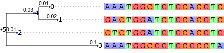

This directory contains examples of various analyses of
a scenario used in the test suite of bpp-phyl.



Most of the analyses operate on input files similar to the JSON file below.

```json
{
"model_and_data" :
  {
  "edges" : [[4, 0], [4, 1], [5, 4], [5, 2], [5, 3]],
  "edge_rate_coefficients" : [0.01, 0.02, 0.03, 0.01, 0.10],
  "root_prior" : [0.25, 0.25, 0.25, 0.25],
  "rate_matrix" : [
	 [0, 1, 3, 1],
	 [1, 0, 1, 3],
	 [3, 1, 0, 1],
	 [1, 3, 1, 0]],
  "rate_divisor" : 5,
  "gamma_rate_mixture" : {"gamma_shape" : 1, "gamma_categories" : 4},
  "character_definitions" : [
	  [1, 0, 0, 0],
	  [0, 1, 0, 0],
	  [0, 0, 1, 0],
	  [0, 0, 0, 1],
	  [1, 1, 1, 1]],
  "character_data" : [
	  [0, 2, 1, 0, 4, 4],
	  [0, 0, 3, 0, 4, 4],
	  [0, 1, 1, 0, 4, 4],
	  [3, 3, 3, 3, 4, 4],
	  [2, 2, 2, 2, 4, 4],
	  [2, 2, 2, 2, 4, 4],
	  [1, 0, 0, 1, 4, 4],
	  [3, 3, 3, 2, 4, 4],
	  [2, 1, 2, 2, 4, 4],
	  [3, 3, 3, 3, 4, 4],
	  [2, 2, 2, 2, 4, 4],
	  [1, 1, 1, 1, 4, 4],
	  [0, 0, 0, 2, 4, 4],
	  [1, 1, 1, 1, 4, 4],
	  [2, 2, 2, 1, 4, 4],
	  [3, 3, 3, 3, 4, 4],
	  [1, 1, 2, 0, 4, 4]]
   },
   "site_reduction" : {"aggregation" : "sum"}
}
```

Here are some explanations of the strings it contains:
<dl>

<dt>model_and_data</dt>
<dd>
This object specifies everything about the input except
for selection/reduction/aggregation requests.
</dd>

<dt>edges</dt>
<dd>
An ordered list of ordered node index pairs.
Edges are indexed according to their position in this list.
This list defines the 'tree topology'.
</dd>

<dt>edge_rate_coefficients</dt>
<dd>
An ordered list of edge-specific rate scaling factors.
The nth coefficient in this list is associated with the nth
entry of the list of edges.
</dd>

<dt>root_prior</dt>
<dd>
An optional prior distribution over states at the node
situated at the root of the tree.
</dd>

<dt>rate_matrix</dt>
<dd>
Off-diagonal entries specify transition rates between states.
The CTMC process defined by this rate matrix is shared across
all edges of the tree, although each edge may further scale this rate
by its own coefficient.
Diagonal entries of this matrix are ignored.
The rate matrix in this particular example defines a K80 process.
</dd>

<dt>rate_divisor</dt>
<dd>
In this example, the rate matrix is scaled by 1/5
so that the off-diagonal entries of each row of the scaled matrix
add up to 1.
</dd>

<dt>gamma_rate_mixture</dt>
<dd>
The 17 sites in this example are assumed to evolve with varying rates.
This variability is modeled by a discrete approximation
of a gamma distribution, as a mixture of rate classes.
</dd>

<dt>gamma_shape</dt>
<dd>
The shape parameter of the gamma distribution of rates,
before discretization.
</dd>

<dt>gamma_categories</dt>
<dd>
The number of categories in the discretized rate distribution.
</dd>

<dt>character_definitions</dt>
<dd>
Observations at nodes of the tree do not necessarily map directly
to states of the CTMC; this matrix defines a soft mapping
from observed 'characters' to the underlying states of the model.
In this example we have five 'characters' and four states.
The first four 'characters' each correspond unambiguously
to an underlying state, while the fifth character indicates
a complete lack of information.
</dd>

<dt>character_data</dt>
<dd>
Entry (i, j) of this matrix indicates which 'character' is observed
at node j of the tree, at alignment column i.
Note that characters observed at leaf nodes unambiguously indicate
one of the states of the model, whereas characters observed at
internal nodes are uninformative.
</dd>

<dt>site_reduction</dt>
<dd>
This option indicates a request to apply some kind of reduction across sites.
This particular example requests the sum of values (e.g. log likelihoods)
across sites; without this option, the value would be
be reported for each site separately.
</dd>

</dl>
